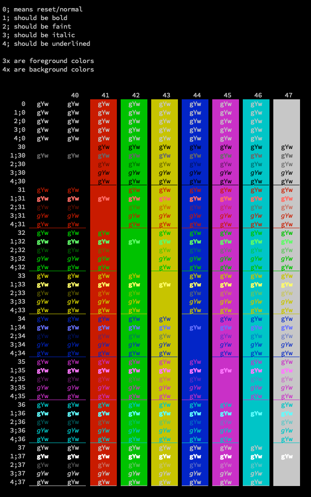
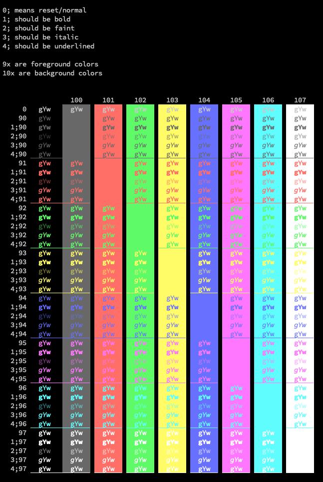
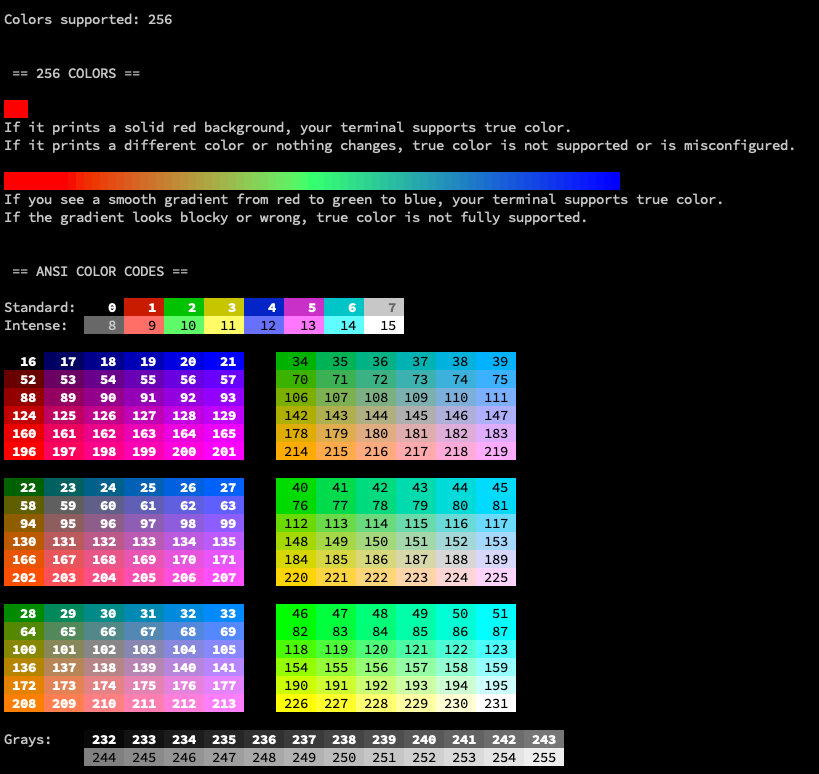

# Console colors

A bunch of scripts to test the colors supported by your linux console or terminal emulator.

I needed these because i work with a lot of consoles and have made a theme or two for them. I am a visual person, and the scripts show all text and colors variations (bold, bright, faint, italic, underlined, foreground, background..) visible on the terminal.

Additionally, it shows how many colors are supported by your console (`tput colors`)

Tested on *nix systems (Ubuntu Server, macOS)

## Notes

- check supported colors: `tput colors`
- test bold: `echo "`tput sgr0`this is `tput bold`bold`tput sgr0`"`
- test bold: `echo -e "text \033[1mbold\033[0m text"`
- test italic: `echo -e "\e[3mabcd\e[23m"`
- test red, bold, underline: `echo -e "\033[31;1;4mHello\033[0m"`

```bash
printf '\e[42;31m%s\e[m%s\n' some text
```

- `\e[` signals the start of an escape code.
- `42` sets the background to color 2 (`4` means bg)
- `31` sets the foreground to color 1 (`3` means fg)
- `m` signals the end of an escape code
- `\e[m` resets the colors to the default.
- `;` is the separator used when specifying multiple formatting attributes
- `0` means reset/normal
- `1` means bold
- `2` means faint
- `3` means italic
- `4` means underlined

Not all consoles/terminal emulators support bold and italic. Some would render bold as a brighter color, giving you additional 8 foreground colors. This is specially true for primitive consoles (e.g. the default linux console that ships with Ubuntu Server) where only 6 or 8 colors are supported

### tput

`tput` is a terminal command for controlling text formatting. It interacts with the terminal to change text attributes, such as color, boldness, and resetting styles.

If you want to use it in a shell script or command line, you should use command substitution like this:

```bash
echo "$(tput sgr0)this is $(tput bold)bold$(tput sgr0)"
```

Or, if used directly in a shell:

```bash
echo "`tput sgr0`this is `tput bold`bold`tput sgr0`"
```

- `tput sgr0` – Resets all terminal text formatting (colors, bold, underline, etc.).
- `this is` – Plain text.
- `tput bold` – Enables bold text formatting.
- `bold` – This word should appear in bold.
- `tput sgr0` – Resets formatting again after the word “bold”.

## ANSI Colors

3-bit and 4-bit colors

> The original specification only had 8 colors, and just gave them names. The SGR parameters 30–37 selected the foreground color, while 40–47 selected the background. Quite a few terminals implemented "bold" (SGR code 1) as a brighter color rather than a different font, thus providing 8 additional foreground colors. Usually you could not get these as background colors, though sometimes inverse video (SGR code 7) would allow that.

8 colors in iTerm2:



8 colors (bright) in iTerm2:



256 colors in iTerm2:



## Links
- [ANSI escape code](https://en.wikipedia.org/wiki/ANSI_escape_code)